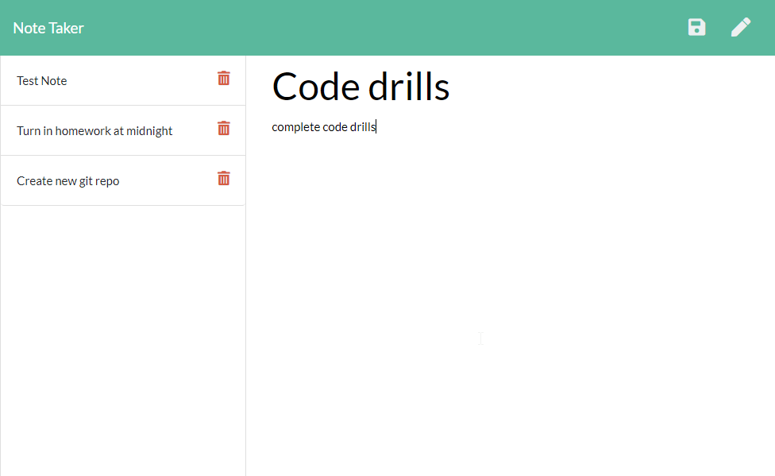
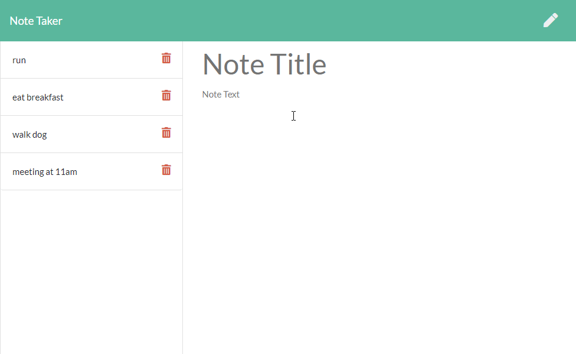

# ExpressNoteTaker

## Summary
A user wanted to be able to write and save notes while also being able to delete notes that were saved previously. Using the node package, "express", API routes were created so data was accurately displayed when a user saves notes as well as deletes them as need be. This application was made as a tool to keep cluttered thoughts and to get things organized on the fly. 

<br>
<br>

## Example 






[Link to Heroku Application](https://mighty-citadel-13218.herokuapp.com/)
<br>
<br>


## Requirements To Run
The "Express" npm package must be installed for the readme.md generator to function properly.
While in Terminal or GitBash depending on your OS, run the command, "npm install express".

<br>
<br>

## Code Snippet
```javascript
app.post("/api/notes", function (req, res) {
    let notesObject = JSON.parse(fs.readFileSync('./db/db.json'));
    let noteBody = req.body
    // pushes parsed notes into saved notes
    notesObject.push(noteBody);
    // writes file to db.json
    fs.writeFile("./db/db.json", JSON.stringify(notesObject), function (err) {
        if (err) console.log(notes);
    })
    res.send();
})
```
This code snippet is an integral part of how this note taker operates. It's one of the backend routes that tells the server to push new notes onto the page but also to save a User's notes into a db.json folder which serves as a database of all saved notes that have not been completed.
<br>
<br>

## Built Using

* [Javascript](https://developer.mozilla.org/en-US/docs/Web/JavaScript)
* [Node.js](https://nodejs.org/en/)
* [JSON](https://www.json.org/json-en.html)
* [Express](https://expressjs.com/)


<br>
<br>

## Author

**Michael Medina** 
- [Link to Github](https://github.com/michaelanthonyyy)
- [Link to LinkedIn](https://www.linkedin.com/in/michael-medina-22aa70200?lipi=urn%3Ali%3Apage%3Ad_flagship3_profile_view_base_contact_details%3B311BosSLTMS4JkhAfkX61A%3D%3D)
- [Link to Portfolio](https://michaelanthonyyy.github.io/portfolio2021/)

<br>
<br>

## LICENSES

Copyright (c) 2021 MIT LICENSE